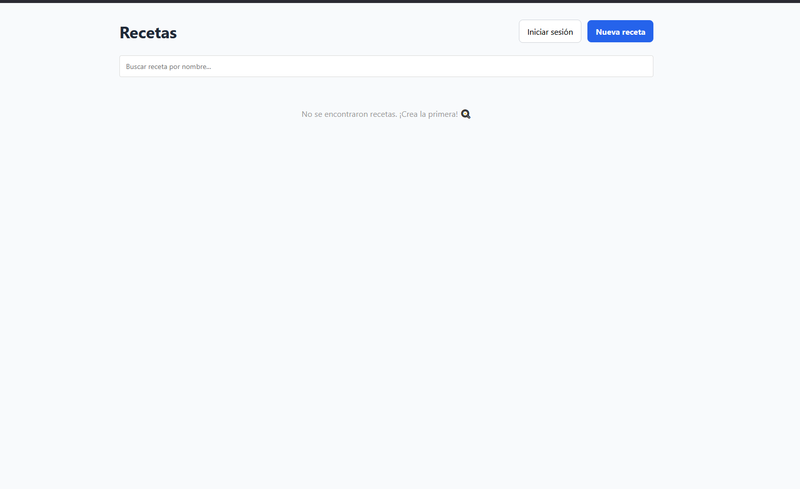
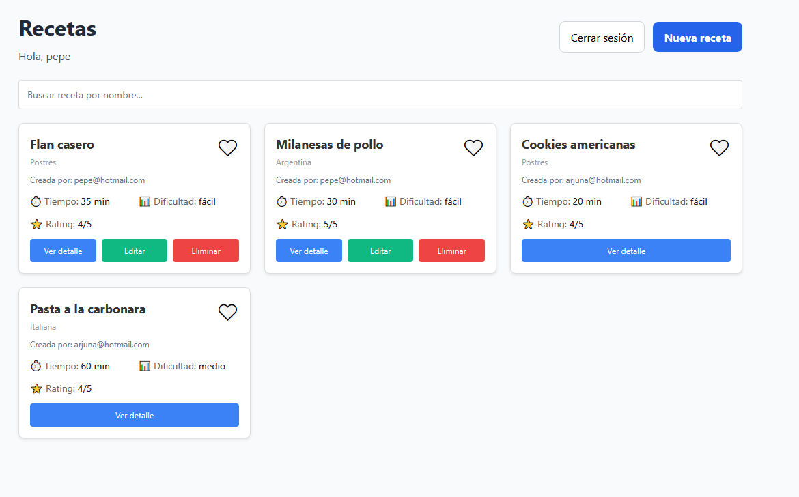
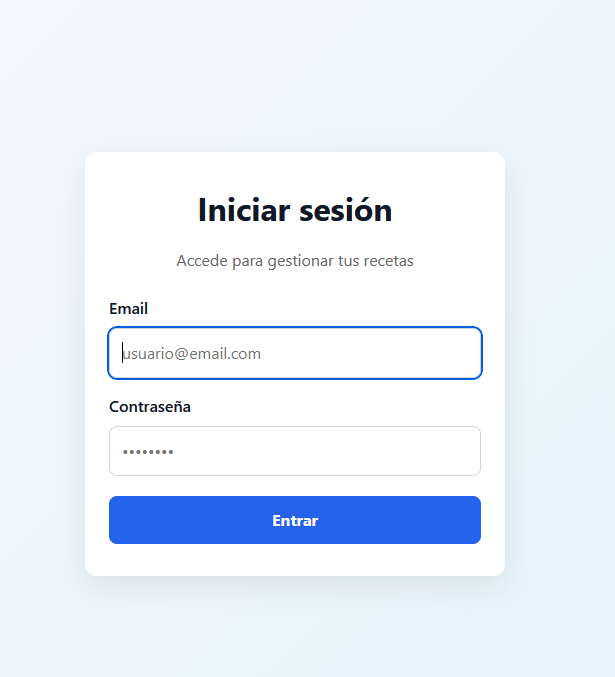
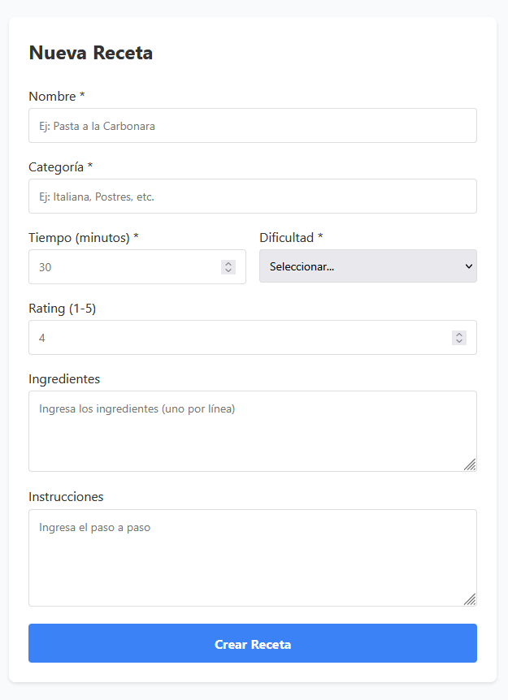
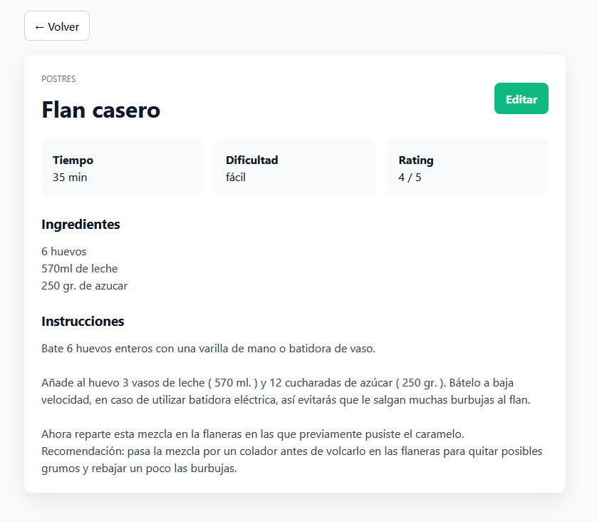
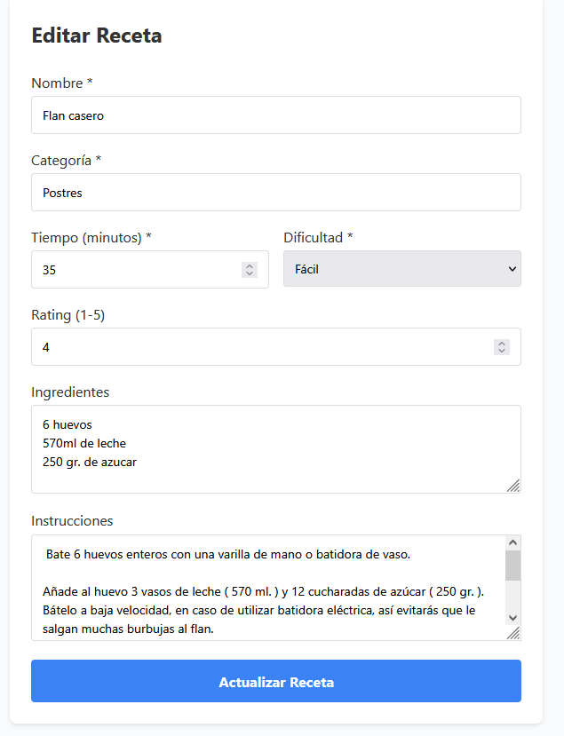
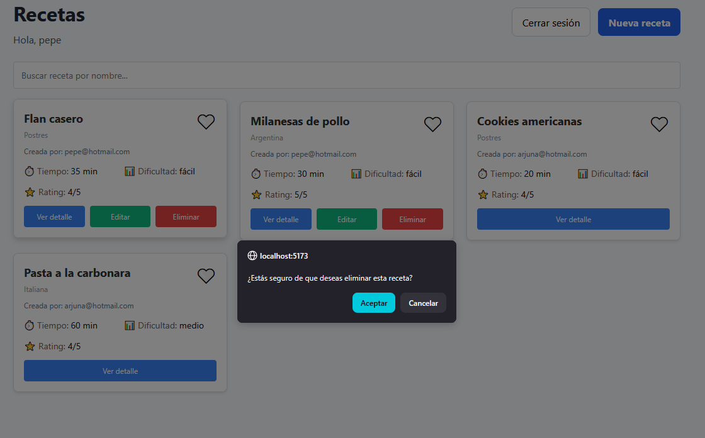

# Proyecto CRUD: Gestor de Recetas 🍳

## Descripción del Proyecto

**Proyecto CRUD de Recetas** es una aplicación web fullstack que permite a los usuarios crear, leer, actualizar y eliminar recetas de cocina. La aplicación está construida con **React 19** + **Vite** como frontend, y **Firebase** (Firestore + Authentication) como backend.

Cada usuario puede gestionar sus propias recetas: crear nuevas, editarlas, eliminarlas, visualizar detalles, buscar por nombre y marcar favoritas. La aplicación garantiza que solo el propietario de una receta pueda modificarla o eliminarla, mediante un sistema de autenticación robusto.

## Temática Elegida: Recetas 📖

### ¿Por qué Recetas?

Se eligió la temática de **Recetas de Cocina** por sus similitudes funcionales con un gestor de tareas (TODO list):

- **Estructura de datos similar**: Ambas tienen propiedades fundamentales (nombre, descripción, estado, propietario)
- **Operaciones CRUD idénticas**: crear, listar, buscar, editar y eliminar
- **Gestión de propietario**: solo quien crea puede modificar
- **Características avanzadas comunes**: búsqueda, filtrado, marcado de favoritos
- **Experiencia previa**: facilita la aplicación de conceptos ya estudiados en contexto diferente

La temática de recetas añade un **contexto real y práctico** que mejora la experiencia de usuario y demuestra aplicabilidad en un dominio común.

### Aclaración
**Esta version es un prototipo** por lo cual tendra varias actualizaciones hasta asemejarse a la imagen.


---

## Relación con Requisitos de la Consigna

### 1. **CREATE (Crear)** ✅
- **Ruta**: `/recetas/nueva`
- **Componente**: `CreateReceta.jsx` + `RecetaForm.jsx`
- **Funcionamiento**: Formulario con campos: nombre, categoría, tiempo, dificultad, ingredientes, instrucciones, rating
- **Validación**: Verifica campos requeridos antes de guardar
- **Autenticación**: Solo usuarios logueados pueden crear
- **Base de datos**: Guarda en Firestore con `usuarioId` y `creadoPor`

### 2. **READ (Leer)** ✅
- **Listado**: Home (`/`) muestra todas las recetas
- **Detalle**: `/recetas/:id` muestra información completa
- **Componentes**: `RecetaList.jsx`, `RecetaCard.jsx`, `RecetaDetail.jsx`
- **Filtrado**: Búsqueda por nombre en tiempo real
- **Ordenamiento**: Recetas ordenadas por fecha de creación (más recientes primero)

### 3. **UPDATE (Actualizar)** ✅
- **Ruta**: `/recetas/:id/editar`
- **Componente**: `EditReceta.jsx`
- **Seguridad**: Solo el propietario puede editar (verificación en frontend y Firestore)
- **Validación**: Los mismos validadores que CREATE
- **Feedback**: Mensaje de éxito/error al actualizar
- **Nota**: Favoritos se guardan en localStorage (no en Firestore)

### 4. **DELETE (Eliminar)** ✅
- **Acción**: Botón "Eliminar" en tarjeta (solo visible para propietario)
- **Confirmación**: `window.confirm()` antes de eliminar
- **Seguridad**: Validación en Firestore (reglas de seguridad)
- **Feedback**: Eliminación inmediata del listado

### 5. **Autenticación** ✅
- **Sistema**: Firebase Authentication (email/password)
- **Ruta**: `/login`
- **Componente**: `Login.jsx`
- **Persistencia**: `onAuthStateChanged()` mantiene sesión activa
- **Protección**: Rutas protegidas via `ProtectedRoute.jsx`
- **Logout**: Botón en header para cerrar sesión

### 6. **Base de Datos** ✅
- **Motor**: Firebase Firestore (NoSQL)
- **Colecciones**: `recetas` (documentos con ID único)
- **Campos**: nombre, categoría, tiempo, dificultad, ingredientes, instrucciones, rating, usuarioId, creadoPor, fechaCreacion
- **Reglas de seguridad**: 
  - Solo lectura para usuarios autenticados
  - Create: usuario actual es propietario
  - Update/Delete: solo propietario

### 7. **Búsqueda y Filtrado** ✅
- **Componente**: `SearchBar.jsx`
- **Funcionalidad**: Búsqueda en tiempo real por nombre de receta
- **Ubicación**: Home page

### 8. **Favoritos** ✅
- **Visualización**: Corazón en cada tarjeta (❤️ favorita, 🤍 no favorita)
- **Almacenamiento**: localStorage con clave `favoritos_${usuarioId}`
- **Persistencia**: Se mantiene tras recargar página
- **Usuario-específico**: Cada usuario tiene sus propios favoritos

---

## Capturas de la Aplicación

### Inicio y listado de recetas




### Autenticación



### Operaciones CRUD






---

## Usuarios Registrados en la App
- **Usuarios**: pepe@hotmail.com, arjuna@hotmail.com
- **Contraseña**: 123456 (para ambos usuarios)

## Tecnologías Utilizadas

### Frontend
- **React 19.2.8** - Framework UI
- **Vite 8.2.2** - Build tool y dev server
- **React Router v7** - Routing
- **Firebase SDK 12.11.0** - Backend

### Backend
- **Firebase Firestore** - Base de datos NoSQL
- **Firebase Authentication** - Autenticación
- **Firestore Security Rules** - Control de acceso

### Desarrollo
- **Node.js** - Runtime
- **npm** - Package manager
- **Vite** - Dev server (hot reload)

---

## Instalación y Uso

### Requisitos Previos
- Node.js (v18+)
- npm o yarn
- Cuenta Firebase

### Instalación

```bash
# Clonar el proyecto
git clone <repo-url>
cd Proyecto_CRUD_Recetas

# Instalar dependencias
npm install

# Crear archivo .env con credenciales Firebase
# (Ejemplo en .env.example)
```

### Variables de Entorno

Crear archivo `.env` en la raíz:

```
VITE_FIREBASE_APIKEY=your_api_key
VITE_FIREBASE_AUTHDOMAIN=your_auth_domain
VITE_FIREBASE_PROJECTID=your_project_id
VITE_FIREBASE_STORAGEBUCKET=your_storage_bucket
VITE_FIREBASE_MESSAGINGSENDERID=your_sender_id
VITE_FIREBASE_APPID=your_app_id
```

### Ejecución

```bash
# Desarrollo (hot reload)
npm run dev

# Build producción
npm run build

# Preview del build
npm run preview
```

La app estará disponible en: `http://localhost:5173`

---

## Estructura del Proyecto

```
src/
├── components/          # Componentes reutilizables
│   ├── RecetaCard.jsx
│   ├── RecetaForm.jsx
│   ├── RecetaList.jsx
│   ├── SearchBar.jsx
│   └── ...
├── views/              # Páginas/vistas
│   ├── Home.jsx
│   ├── Login.jsx
│   ├── CreateReceta.jsx
│   ├── EditReceta.jsx
│   ├── RecetaDetail.jsx
│   └── ...
├── services/           # Lógica de negocio
│   └── recetasService.js
├── validators/         # Validación de datos
│   └── recetaValidator.js
├── router/            # Configuración de rutas
│   ├── AppRouter.jsx
│   └── ProtectedRoute.jsx
├── firebase/          # Configuración Firebase
│   └── config.js
└── App.jsx
```

---

## Funcionalidades Clave

✅ **Autenticación segura** con Firebase Auth  
✅ **CRUD completo** de recetas  
✅ **Búsqueda en tiempo real** por nombre  
✅ **Favoritos locales** con localStorage  
✅ **Control de propietario** (solo créador edita/elimina)  
✅ **Validación de formularios**  
✅ **Rutas protegidas** para usuarios autenticados  
✅ **Interfaz responsiva** y amigable  
✅ **Mensajes de error/éxito** informativos  

---

## Autor

Proyecto realizado como actividad evaluativa del curso.

**Temática**: Recetas de Cocina  
**Framework**: React + Vite  
**Base de datos**: Firebase Firestore  
**Fecha**: Septiembre 2026
